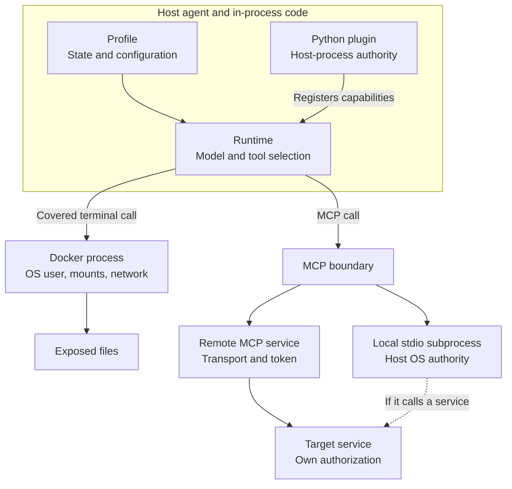
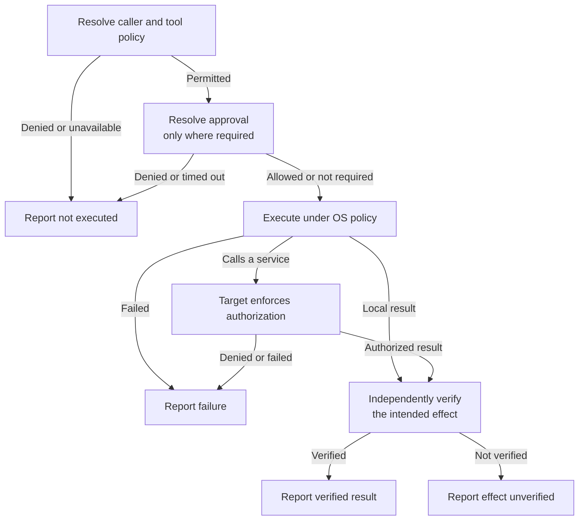

# Hermes Agent Architecture, Part 5: A Separate Profile Is Not a Sandbox

*What profiles, approvals, credentials, and execution boundaries actually control*

I gave Hermes a fresh profile and a small workspace. It could still read a marker beside that workspace.

To find out what actually changed access, I ran the same Python probe through the local backend, through Docker, and through Docker with one extra mount. The two markers were harmless test files. The request was simply to read them and report what was reachable.

| Configured posture | Workspace marker | Sibling marker |
| --- | --- | --- |
| Local backend, starting in the workspace | Readable; hash matched | Readable; hash matched |
| Docker, sibling directory unmounted | Readable; hash matched | Unavailable: `FileNotFoundError` |
| Same Docker settings, sibling mounted read-only | Readable; hash matched | Readable; hash matched |

All three were real model-to-Hermes-tool runs. Every terminal call completed successfully; the probe handled the missing sibling file as a read result. A zero exit code therefore did not mean both files were accessible.

The host verifier checked the read results against a separately created manifest of expected file hashes. It also confirmed that both original markers still existed. The model’s summary was a claim to check. The probe bytes and canary contents were unchanged across attempts. Receipt filenames and interpreter commands differed by environment, so this was the same logical request, not a byte-identical prompt.

Nothing escaped. The local run used the host user’s authority. The first Docker run could not see a path that was not exposed to its filesystem namespace. The positive control then added one read-only mount, and the path became visible.

The first two rows compare configured postures, not one isolated variable. OS identity, filesystem namespace, and backend all changed. The tighter comparison is between the two Docker rows, where adding the explicit mount changed what the process could reach.

> **Experiment note.** Executed September 4, 2026: provider-backed Windows runs against Hermes v0.21.0 in a disposable profile, with the Docker probe running on Linux. The final runs used the release lockfile. Exact setup, provider/model, request and tool counts, sanitized receipts, portability findings and reproduction steps are in the [Part 5 lab](https://github.com/vingov/the-agent-stack-labs/tree/dev/vino/hermes-part5-security-boundaries/series/hermes-agent/v0.21.0/labs/05-security-boundaries).

> A profile separates state. A sandbox limits authority.

That distinction is the center of this post. Caller authorization, profile selection, tool exposure, approval, execution isolation, credentials, and effect verification are separate contracts.

[Part 4](https://theagentstack.substack.com/p/hermes-agent-architecture-part-4) asked whether an operation really succeeded. Part 5 moves one step earlier: even when an operation succeeds, whose authority allowed it to happen?

## The profile selected state. The execution setup determined access.

The harness used Hermes’s actual agent loop with a disposable `HERMES_HOME`, the directory that owns profile state. It disabled memory and project-context loading and exposed only the terminal toolset. Approval mode was manual, with unattended approval set to deny.

A Hermes profile selects a state namespace. The [release profile guide](https://github.com/NousResearch/hermes-agent/blob/29112bef099274229cadff79cdff7bf7b99c4b77/website/docs/user-guide/profiles.md) lists configuration, environment, personality, sessions, memory, logs, scheduled jobs, and gateway state as profile-owned data. It also draws a separate line around `terminal.cwd` and filesystem sandboxing. Selecting a different profile can select different tools or credentials, so the configuration can change authority even though the profile itself creates no containment boundary.

The live local run made that separation concrete. `cwd=workspace` set the starting directory; the same host identity still resolved `../outside/outside.txt`.

The Docker command ran as a non-root Linux user, with networking disabled, capabilities dropped and privilege escalation disabled. Its container was scoped to the session.

The container exposed more than `/workspace`. The captured `docker inspect` showed `/workspace` as read-write plus eleven read-only skill, attachment, image, and cache mounts under `/root/.hermes`. Every source path was verified inside the disposable lab tree. There was no profile-root mount and no `auth.json` mount.

The sibling canary remained unavailable because its directory was absent from the container’s exposed filesystem. Once that exact synthetic directory was mounted read-only at `/outside`, the same probe read it and produced the expected digest.

That is why configuration intent is not enough. The receipt needs the effective identity, mounts, environment, network mode, and result.

The host process still owned the model call. Provider requests occurred outside the execution container, and the probe itself made no network request. Both final Docker receipts reported zero resolved passthrough variables, but that does not mean the process had an empty environment. It also does not prove that network exfiltration or credential theft was adversarially tested.

The final verifier also waited for asynchronous cleanup and checked that the session container had been removed. Returning from a cleanup call was not enough.

## One request crosses several owners

The experiment entered directly at the runtime through a controlled harness. A deployed request may begin earlier, through Telegram, Slack, an API, a webhook, or another adapter.

This ownership map separates the host from the execution and extension paths. It is an architecture sketch, not a claim that every path has identical guards:

The profile chooses state; it does not enclose these processes in a new security boundary.

The gateway decides who may dispatch work. The profile and session choose durable state and continuity. The runtime exposes tools. Policy may block a proposal. The backend supplies process reach, the target service enforces its own authorization, and a verifier checks the claimed effect.

An allowlist can reject an unknown caller. It does not shrink the host filesystem or the token attached to a later service call.

A toolset can hide a capability from the model. It does not reduce the permissions inside a capability that remains exposed.

An approval can permit one proposal. It does not prove that the command ran inside the intended boundary or changed the intended target.

The [release security policy](https://github.com/NousResearch/hermes-agent/blob/29112bef099274229cadff79cdff7bf7b99c4b77/SECURITY.md) makes the core trust model unusually explicit: the operating system is the load-bearing containment boundary against adversarial model output. In-process approval, redaction, and scanning remain useful guardrails, but they are not substitutes for OS isolation.

## A control is only as wide as its path

The canary experiment tested backend authority. A second set of provider-free controls tested narrower paths in the same release.

With `HERMES_WRITE_SAFE_ROOT` set to the disposable workspace, a real `write_file` call created the expected file inside the root. A write to a synthetic sibling path returned an error, and the target remained absent.

That receipt belongs to the file-mutation path. The [current security guide](https://hermes-agent.nousresearch.com/docs/user-guide/security) makes the same scope distinction: its write-root policy governs supported file APIs, while shell containment belongs to the execution boundary.

The approval control produced a different receipt. A separate harmless inline Python write was classified as script execution through `-c`. In single-query mode, with no operator available, Hermes denied it. The tool returned status `blocked`, exit `-1`, and the synthetic target remained absent.

This also caught a harness expectation error: the test had assumed the harmless script would pass. Hermes classified it anyway. The receipt covers that configured path, not every possible write.

A provider-free callback test then exercised the protected `AGENTS.md` approval path. A scripted denial left the file absent. An approve-once decision created the exact harmless content. After the callback was removed, the next write was denied and the prior content stayed unchanged. This was not a human UI click or model run, and it created no permanent grant.

The stdio MCP control used a real MCP SDK 2.0 subprocess with two synthetic tools. Hermes registered only `environment_report`; `withheld_noop` never appeared in the effective registry. The allowed tool was invoked. A synthetic ambient variable was absent, while a synthetic variable explicitly configured for the server was present.

That result proves tool and environment filtering for this stdio path. It does not prove that every credential is removed. The release environment builder also admits a safe baseline and supports explicitly tagged secret-source injection. The receipt says nothing about remote MCP OAuth, token audience, target-service authorization, or returned-content trust. Those are separate contracts described by the [Hermes MCP guide](https://hermes-agent.nousresearch.com/docs/user-guide/features/mcp) and the [MCP authorization specification](https://modelcontextprotocol.io/specification/2025-11-25/basic/authorization).

The final provider-free control stopped before an OSV request. From synthetic dependency declarations, discovery found an exact package/version pair, omitted an unversioned requirement, and could not resolve a local Python MCP script into a package and version. No advisory lookup ran, and nothing was installed. The [CLI reference](https://hermes-agent.nousresearch.com/docs/reference/cli-commands) describes the broader command; this receipt covers discovery only.

| Control | What the receipt established | What it did not establish |
| --- | --- | --- |
| Profile and `cwd` | Which Hermes state and relative-path base were selected | Host filesystem confinement |
| Docker mount posture | The sibling path was absent until explicitly mounted | Whole-agent isolation or adversarial egress resistance |
| File safe root | `write_file` rejected a sibling target and left it absent | Shell or plugin confinement |
| Approval gate | One classified single-query command was blocked before mutation | Complete mediation of every action |
| Approval callback | Deny and approve-once changed one protected-file outcome | Human UI behavior or a permanent policy grant |
| MCP tool filter | One synthetic tool was registered and one was withheld | Downstream service permissions |
| MCP environment filter | One ambient variable was absent and one explicit variable was present | An empty or universally credential-free child environment |
| Audit discovery | One exact package pin was discoverable; other forms were omitted | An OSV result, installed-state audit, or behavior review |

A request can stop at several different points. This lifecycle shows the decision and reporting boundaries; approval is conditional on the path being used:

An audit store records what these layers decided and observed. It does not enforce the decision. A transcript can contain a successful-looking sentence and still be weaker evidence than the tool receipt and target-side read-back.

## Persistence and extensions move the authorization question

[Part 3](https://theagentstack.substack.com/p/hermes-agent-architecture-part-3) separated a remembered fact from a reusable procedure. Part 4 showed that a scheduled or delegated run still needs a real execution contract and effect receipt.

Security adds time to both problems.

A stored procedure may preserve how to publish a report. The prior approver, target and credential identity should remain as provenance. Store the identity and scope, never the secret itself. They should not become current permission merely because the procedure survived into another run.

My design recommendation is simple:

> Preserve the instruction and prior decision as provenance. Resolve authority again when the action runs.

Hermes v0.21.0 does not establish that as one universal guarantee across every capability. It is the invariant I would require from the control plane that launches durable work.

Plugins and MCP also need different threat models.

A Python plugin loads inside the agent process. The [current plugin guide](https://hermes-agent.nousresearch.com/docs/user-guide/features/plugins) describes enablement and capability grants as consent and audit controls, then explicitly says they are not process isolation. General third-party enablement also has exceptions for built-in and specialized plugin categories, so “plugins are disabled by default” is too broad without qualification.

A stdio MCP server is a subprocess with its own environment and registered tools. A remote MCP server adds transport, token, and resource authorization. Filtering tools or environment variables can narrow exposure. It cannot make returned content trustworthy or prove that a remote token has the correct audience and scope.

Tool output can carry instruction-shaped content. [AgentDojo](https://arxiv.org/abs/2406.13352) and [OWASP’s prompt-injection guidance](https://genai.owasp.org/llmrisk/llm01-prompt-injection/) are useful threat models, not evidence of an exploit against this release.

The same provenance problem applies to memory. Part 3 used the [Context Engineering: Sessions and Memory](https://www.kaggle.com/whitepaper-context-engineering-sessions-and-memory) framework to separate declarative facts from procedures and to reason about origin, freshness, and lineage. In a security-sensitive workflow, those attributes should influence whether durable context is treated as advice, evidence, or a candidate action that still requires current policy.

## Where it breaks

**The profile looks isolated, but a sibling file is readable.** The misunderstood boundary is profile state versus host authority. Inspect the active profile, backend, OS identity, `cwd`, requested absolute path, and effective mounts. Stop the run and verify the touched target. Move execution to a lower-privilege identity or a backend that exposes only required paths. Anything deliberately mounted or reachable through another path remains inside the authority envelope.

**An authorized caller reaches more capability than intended.** The ingress rule worked, but the selected profile exposed a broad tool or credential. Inspect the caller decision, profile route, effective tool registry, credential subject, scopes, and target. Disable the capability or revoke the token before replaying the request. Residual risk remains wherever several trusted callers share one undifferentiated runtime authority.

**A guardrail is mistaken for containment.** A file API rejects one write, or an approval gate blocks one command, and the team assumes the machine is protected. Inspect the exact tool path, policy result, backend, and target-side state. Recover by verifying the target, then enforce the boundary at the OS or service layer. Heuristics and API-specific guards can still miss paths they do not own.

**The container exposes more than the configuration summary suggested.** The symptom is an unexpected readable path or credential. Inspect the actual container identity, mount list, modes, environment, runtime user, network mode, and lifecycle. Rebuild from the smallest effective policy and rotate any exposed credential. Read-only mounts still disclose data, and network isolation does not remove filesystem exposure.

**Execution returns green, but the effect is wrong or absent.** Inspect the tool payload, target identifier, artifact hash, timestamp, and independent read-back. Report “executed, effect unverified” until the target-side verifier succeeds. Even a correctly authorized and contained command can operate on the wrong resource.

## What I would steal

**1. Give state and authority different owners.** The profile selector owns which durable state enters the run. The OS, backend, and service policy own reach. Record any authority change caused by selecting a profile, including different tools or credentials; state separation must never be mistaken for containment. Emit both identities in the run receipt.

**2. Verify the effective posture, not the intended configuration.** The Docker result depended on the real mount table, not on a sentence saying “sandboxed.” Record user, mounts, network mode, environment sources, lifecycle, and backend identity. Synthetic canaries make the boundary observable without touching real data.

**3. Resolve authority at action time.** Keep old approval decisions as provenance, not reusable permission. The control plane should resolve the current caller, target, tool, credential, and policy when durable work resumes. Emit the policy version and decision that governed that attempt.

**4. Record decision, execution, and effect separately.** An approval receipt says a proposal was allowed. An execution receipt says a backend returned. A verification receipt says the intended target state exists. Operators need all three to find the first broken contract.

**5. Treat extensions as process and credential boundaries.** Record what loaded, which tools appeared, where code ran, what environment crossed, and which downstream identity acted. A manifest, grant, or dependency scan covers only part of that review.

### Reproduce the boundary safely

The [companion lab](https://github.com/vingov/the-agent-stack-labs/tree/dev/vino/hermes-part5-security-boundaries/series/hermes-agent/v0.21.0/labs/05-security-boundaries) has three optional entry points:

- **Explorer** uses supplied receipts and the verifier offline. It requires neither Hermes nor a provider.
- **Builder** runs the real terminal-backend comparison, with an optional live model path.
- **Investigator** exercises file safety, approval callbacks, stdio MCP filtering, and audit discovery without a provider.

Use only synthetic target files and variables. The optional live model path needs provider authentication, but that credential stays with the host agent rather than being deliberately forwarded into the execution container. The runner waits for cleanup and verifies removal of its own session containers.

### Recap

The same disposable profile and logical request could read a sibling file under the local backend. A session-scoped Docker posture could not read it when the directory was absent. Adding that directory back as a read-only mount restored access.

The profile selected state. The mount and OS identity selected reach.

Across this series, Part 1 traced gateways, sessions, and the agent loop. Part 2 opened prompt assembly and compression. Part 3 separated facts, procedures, and durable writes. Part 4 separated direct, delegated, and scheduled work from verified effects. Part 5 closes the season by separating identity, capability, approval, execution, and evidence.

Hermes feels persistent and capable because several systems cooperate. It stays understandable only when state ownership, execution ownership, authority, and evidence remain distinct.

If these source-and-experiment architecture teardowns are useful, subscribe to The Agent Stack.

**Which boundary do teams most often over-trust: the allowlist, the approval prompt, or the sandbox?**

### Sources

Observed behavior is grounded in the tested release and lab receipts. Current documentation was checked September 4, 2026 and may describe later changes.

- [Hermes Agent release](https://github.com/NousResearch/hermes-agent/releases/tag/v2026.8.31) and [release security policy](https://github.com/NousResearch/hermes-agent/blob/29112bef099274229cadff79cdff7bf7b99c4b77/SECURITY.md): the tested version and its containment trust model.
- [Profiles, workspaces, and sandboxing](https://hermes-agent.nousresearch.com/docs/user-guide/profiles): the distinction between state selection, starting directory and filesystem reach.
- [Security guide](https://hermes-agent.nousresearch.com/docs/user-guide/security) and [terminal configuration](https://hermes-agent.nousresearch.com/docs/user-guide/configuration): current guardrail scope and execution settings.
- [Plugin enablement and capability boundaries](https://hermes-agent.nousresearch.com/docs/user-guide/features/plugins): consent controls and the limits of in-process extensions.
- [Hermes MCP configuration](https://hermes-agent.nousresearch.com/docs/user-guide/features/mcp) and [MCP authorization specification](https://modelcontextprotocol.io/specification/2025-11-25/basic/authorization): tool filtering, child environments and separate service authorization.
- [CLI security-audit reference](https://hermes-agent.nousresearch.com/docs/reference/cli-commands): what the broader audit command covers beyond this lab's discovery control.
- [Context Engineering: Sessions and Memory](https://www.kaggle.com/whitepaper-context-engineering-sessions-and-memory): provenance and freshness for durable context.
- [AgentDojo](https://arxiv.org/abs/2406.13352) and [OWASP prompt-injection guidance](https://genai.owasp.org/llmrisk/llm01-prompt-injection/): external threat models for untrusted tool content.

### Hermes Agent Architecture

- [Part 1: Gateway, Sessions, and the Agent Loop](https://theagentstack.substack.com/p/hermes-agent-architecture-part-1)
- [Part 2: Prompt Assembly, Context Files, and Compression](https://theagentstack.substack.com/p/hermes-agent-prompt-assembly-compression)
- [Part 3: Memory, Skills, and the Self-Improvement Loop](https://theagentstack.substack.com/p/hermes-agent-architecture-part-3)
- [Part 4: Tools, Plugins, Delegation, and Persistent Work](https://theagentstack.substack.com/p/hermes-agent-architecture-part-4)
- Part 5: Security Boundaries, Profiles, and Safe Deployment

---
