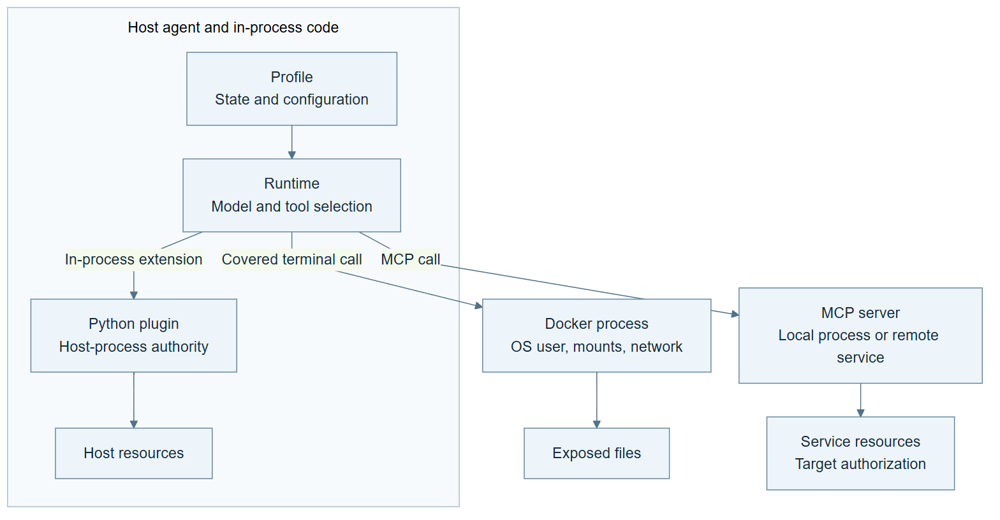
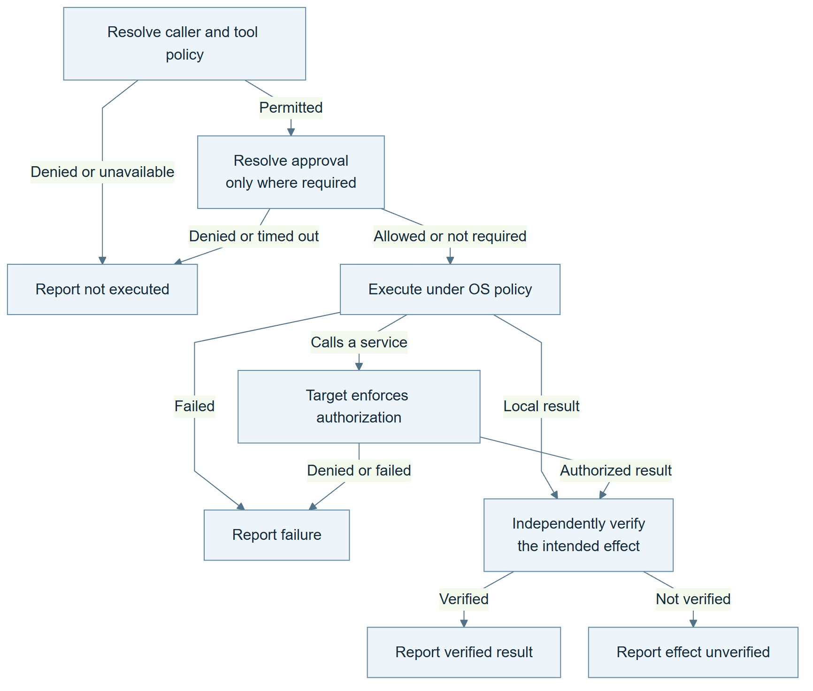

# Article diagrams

These figures have different jobs: the first locates execution authority; the second follows a proposed action to a verified or unverified result. Both were rendered with Mermaid CLI 11.12.0 and visually inspected. The Markdown article contains the same Mermaid source.

## 1. Ownership map



Caption: A profile selects state. The host process, execution backend and target service retain distinct authority.

Use the [PNG](authority-map.png) in a publishing editor, the [SVG](authority-map.svg) for scalable output, or edit [the Mermaid source](authority-map.mmd).

## 2. Action lifecycle



Caption: A policy decision, a completed execution and a verified effect are three different receipts. Approval is conditional on the tool path.

Use the [PNG](action-lifecycle.png) in a publishing editor, the [SVG](action-lifecycle.svg) for scalable output, or edit [the Mermaid source](action-lifecycle.mmd).

## Render again

From this directory, with Node.js and a Chromium installation available:

```text
npx --yes --package @mermaid-js/mermaid-cli@11.12.0 mmdc -i authority-map.mmd -o authority-map.png -c mermaid-config.json -w 1600 -s 2 -b white
npx --yes --package @mermaid-js/mermaid-cli@11.12.0 mmdc -i action-lifecycle.mmd -o action-lifecycle.png -c mermaid-config.json -w 1600 -s 2 -b white
```

Replace `.png` with `.svg` for vector output. A system Chrome executable can be selected through Mermaid CLI's Puppeteer configuration option. These commands download the renderer if it is not already installed.

The PNGs are supplied because an article editor may not render Mermaid blocks. Actual Substack editor layout still depends on the selected image size and theme.
